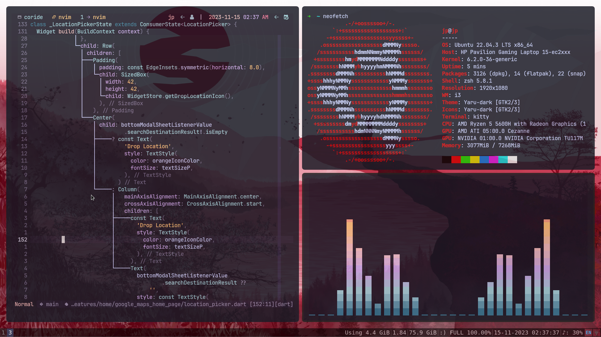
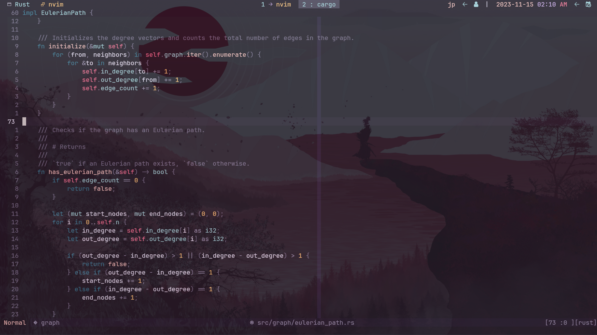

# Dotfiles for Ubuntu

- **Window Manager:** i3wm
- **PDE:** Neovim
- **Terminal:** Tmux + kitty
- **Compositor:** Picom
- **Shell:** zsh (oh-my-zsh)

---

## i3 Window Manager

*This is a screenshot of my i3wm setup. I've configured it for a minimalistic and efficient workflow, with keybindings optimized for my daily tasks. Feel free to explore the configuration files to customize it according to your preferences.*

---

## Tmux and Neovim

*In this screenshot, you can see Tmux and Neovim working together seamlessly. I use Tmux for managing multiple terminal sessions, and Neovim as my text editor with a variety of plugins and configurations. Check out the respective configuration files for more details on how I've set them up.*

---

